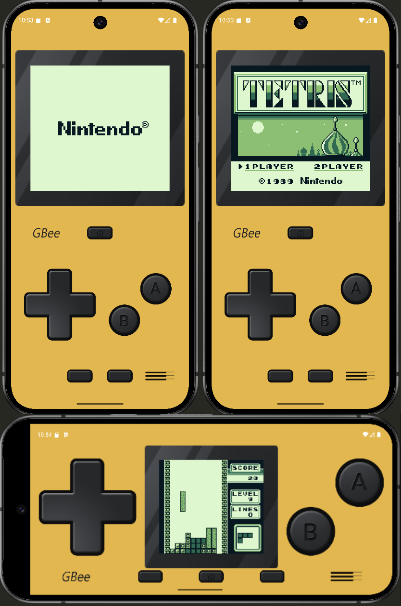
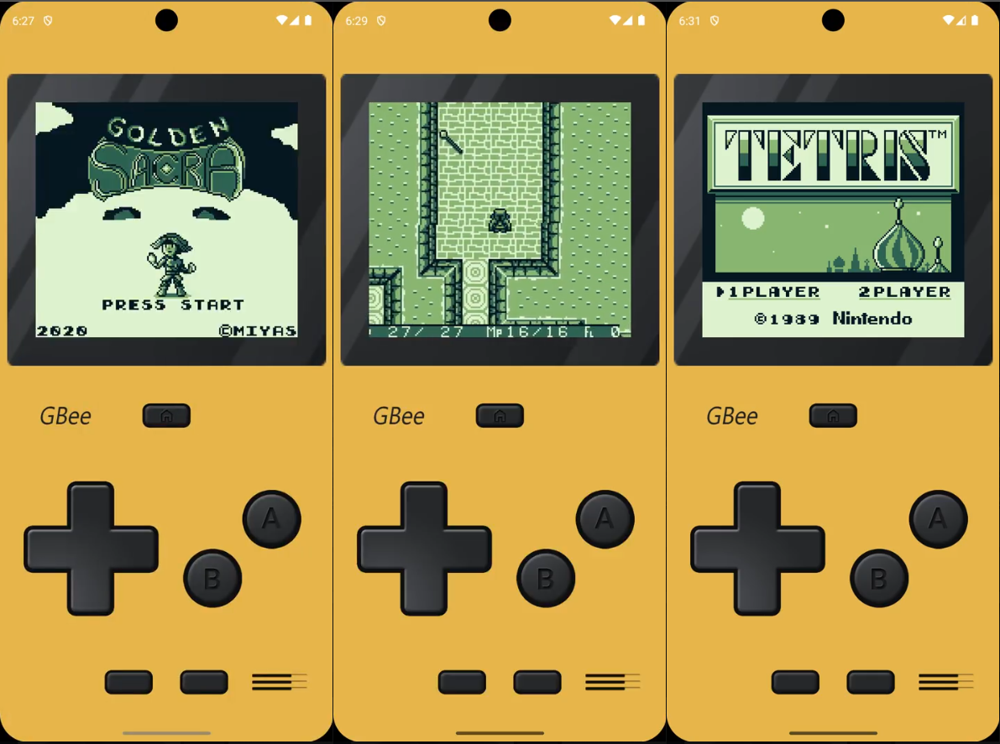

<p align="center">
  
</p>

<h1 align="center">GBee</h1>

<p align="center">
  Emulador de Nintendo Game Boy para Android, desarrollado desde cero en Kotlin.
</p>

## Sobre el proyecto

GBee nace con el objetivo de comprender en profundidad cómo puede simularse el comportamiento de una consola y, en particular, el funcionamiento interno de Game Boy. La emulación no solo permite disfrutar de juegos antiguos en plataformas modernas: también ofrece una oportunidad para estudiar su arquitectura y contribuir a la preservación de la historia de los videojuegos.

El proyecto busca reproducir el hardware original de una forma precisa y comprensible. Por ello, además de ser una aplicación Android funcional, GBee está planteado como herramienta de aprendizaje y como base para futuras mejoras o estudios más profundos sobre emulación.

Su desarrollo constituye un reto técnico que combina arquitectura de sistemas, programación de bajo nivel, sincronización, representación gráfica y diseño de interfaces táctiles.

> [!IMPORTANT]
> GBee es un proyecto educativo todavía en desarrollo. La compatibilidad no es completa y algunas funciones de la consola aún no están implementadas.

## Funcionalidades

- CPU con registros, ALU y conjunto de instrucciones de Game Boy.
- Mapa de memoria y acceso coordinado a ROM, WRAM, HRAM, VRAM, OAM y registros de E/S.
- Temporizadores, interrupciones y transferencia DMA.
- PPU con modos de escaneo y renderizado de Background, Window y sprites.
- Pixel FIFO independiente para BG/WIN y OBJ, con mezcla, transparencia y prioridades.
- Entrada mediante controles táctiles de Android.
- Importación y biblioteca local de ROMs.
- Datos de las ROMs almacenados con Room.
- Interfaz adaptable y sistema de skins personalizadas.
- Soporte actual para cartuchos NoMBC y MBC1.

## Capturas

<p align="center">
  
  &nbsp;&nbsp;
  
</p>

La interfaz busca evocar la estética de la consola original mediante un diseño sencillo y adaptable. El usuario puede organizar sus ROMs y modificar colores, imágenes y elementos de los controles mediante el sistema de skins.

## Arquitectura

GBee divide la emulación en módulos independientes para facilitar su comprensión, validación y ampliación:

| Módulo | Responsabilidad |
|---|---|
| `Emulator` | Coordina los componentes y mantiene el ciclo principal de emulación. |
| `CPU` | Ejecuta instrucciones y simula registros, PC, SP y operaciones de la ALU. |
| `Memory` | Enruta las lecturas y escrituras hacia cada región del mapa de memoria. |
| `ROM` / `MBC` | Carga el cartucho, interpreta su cabecera y gestiona sus bancos de memoria. |
| `RAM` | Gestiona WRAM y HRAM durante la ejecución. |
| `PPU` | Simula los modos gráficos, las scanlines, VRAM, OAM y la salida de vídeo. |
| `FifoFetcher` | Obtiene tiles y sprites, mantiene los FIFO de píxeles y realiza la mezcla final. |
| `Timer` / `Interrupt` | Sincroniza temporizadores y atiende las interrupciones del sistema. |
| `DMA` | Transfiere datos hacia OAM sin intervención directa de la CPU. |
| `IO` | Gestiona joypad, registros de E/S y comunicación entre módulos. |

El ciclo principal ejecuta la CPU y convierte los ciclos consumidos en avances de Timer, PPU y DMA. De esta forma, cada componente progresa de manera coordinada con el tiempo emulado.

## Requisitos y compilación

- Android Studio con soporte para Android Gradle Plugin 9.3.1.
- JDK 17.
- Android SDK 37.
- Dispositivo o emulador con Android 8.0 (API 26) o posterior.

Clona el repositorio y compila el APK de depuración con el wrapper incluido:

```bash
git clone <URL_DEL_REPOSITORIO>
cd GBee
./gradlew assembleDebug
```

El APK se genera en:

```text
app/build/outputs/apk/debug/app-debug.apk
```

También puedes abrir el proyecto directamente en Android Studio y ejecutar el módulo `app` sobre un dispositivo o emulador.

Para ejecutar las pruebas unitarias:

```bash
./gradlew test
```

## Uso

1. Abre GBee y pulsa el botón para añadir una ROM.
2. Selecciona un archivo compatible desde el almacenamiento del dispositivo.
3. Pulsa sobre la ROM añadida para iniciar la emulación.
4. Usa los controles táctiles o personaliza su apariencia desde los ajustes.

El repositorio no incluye juegos comerciales. Utiliza únicamente ROMs que puedas usar legalmente.

## Estado y trabajo futuro

El núcleo permite ejecutar ROMs NoMBC y MBC1, pero el proyecto todavía no pretende ofrecer compatibilidad completa. Las principales líneas de trabajo son:

- Completar y validar MBC1, incluida la RAM externa y su persistencia.
- Añadir MBC2, MBC3 y MBC5 para ampliar el catálogo compatible.
- Implementar el módulo de audio y sus cuatro canales.
- Completar las características específicas de Game Boy Color.
- Añadir guardado y carga de partidas o estados.
- Mejorar la precisión de temporización de CPU, PPU y acceso a memoria.
- Ampliar las pruebas automatizadas con ROMs de diagnóstico.
- Incorporar más opciones gráficas y de configuración.

## Documentación

- [Memoria completa del proyecto](docs/Latex/main.pdf)
- [Funcionamiento del FIFO Fetcher](docs/fifo-fetcher.md)
- [Notas generales de implementación](docs/general.md)

La memoria describe la motivación, el diseño, la arquitectura interna y el proceso de desarrollo completo, incluyendo CPU, memoria, ROM, interrupciones, temporizadores, DMA, PPU e interfaz Android.

## Autoría

Proyecto desarrollado por **Ángel Jesús Terol Martínez** como trabajo académico y proyecto personal de aprendizaje sobre emulación y desarrollo Android.

El nombre GBee combina las siglas de Game Boy (`GB`) con la palabra inglesa *bee*. Su identidad visual utiliza el amarillo y el negro para integrar los conceptos de emulador, Game Boy y abeja en una imagen sencilla y reconocible.
