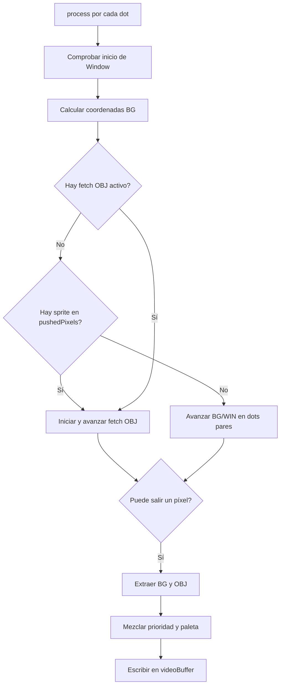

# FIFO Fetcher de la PPU

Este documento describe `FifoFetcher.kt`, responsable de producir los píxeles de Background/Window (BG/WIN), obtener los píxeles de objetos (OBJ o sprites), mezclarlos y escribir el resultado de cada scanline en el búfer de vídeo.

## Flujo general

`PPU.drawLCDMode()` llama a `process()` una vez por dot durante el modo 3. El flujo es:



El fetcher BG/WIN avanza cada dos dots. Un fetch OBJ se procesa dot a dot y bloquea temporalmente `pushPixelsToBuffer()`, alargando el modo 3. `pushedPixels` representa la coordenada X visible; `lineX` también incluye los píxeles de BG descartados por `SCX & 7`.

## Registros y coordenadas que usa el fetcher

Los nombres `SCX`, `LY`, `WX`, etc. no son variables arbitrarias del emulador: son registros de la PPU accesibles mediante direcciones de memoria. El juego escribe algunos de ellos para configurar la imagen y la PPU actualiza otros mientras dibuja la pantalla.

| Registro | Dirección | Significado en `FifoFetcher` |
|---|---:|---|
| `LCDC` | `0xFF40` | Control general del LCD. Sus bits habilitan LCD, BG/WIN y OBJ, seleccionan los tilemaps, el modo de direccionamiento de tiles y el tamaño de los sprites. |
| `SCY` | `0xFF42` | Scroll vertical del Background. La fila del mapa que se muestra se obtiene con `SCY + LY`. |
| `SCX` | `0xFF43` | Scroll horizontal del Background. Selecciona el tile inicial y también el desplazamiento fino dentro de ese tile. No desplaza Window ni los sprites. |
| `LY` | `0xFF44` | Línea que la PPU está procesando: `0..143` durante la imagen visible y `144..153` durante VBlank. En modo 3 también es la coordenada Y de destino en `videoBuffer`. |
| `LYC` | `0xFF45` | Valor con el que se compara `LY` para generar la condición de coincidencia de STAT. No participa directamente en el fetch de píxeles. |
| `BGP` | `0xFF47` | Paleta monocroma de BG/Window en DMG. Convierte cada índice de color `0..3` en uno de los cuatro tonos. |
| `OBP0`, `OBP1` | `0xFF48`, `0xFF49` | Paletas monocromas de los sprites en DMG. El atributo del OBJ decide cuál se aplica. |
| `WY` | `0xFF4A` | Primera scanline en la que Window puede aparecer. Window es elegible verticalmente cuando `LY >= WY`. |
| `WX` | `0xFF4B` | Posición horizontal de Window codificada con un offset de hardware. Su borde izquierdo visible es `WX - 7`, no `WX`. |

`WX` y `WY` colocan Window respecto a la pantalla; no son valores de scroll dentro de su tilemap. Por eso, cuando Window comienza, sus coordenadas de tile parten de cero. En cambio, `SCX` y `SCY` desplazan la vista sobre el tilemap de Background, que mide 32×32 tiles y se repite al superar sus límites.

Los campos X e Y de OAM también contienen offsets de hardware. La posición visible de un sprite se calcula como `OAM_X - 8` y `OAM_Y - 16`. Esto permite representar sprites parcialmente fuera de los bordes superior e izquierdo.

### Cambio de `SCX` durante un frame y scroll por secciones

El scroll por secciones no evita el registro `SCX`: lo reutiliza varias veces durante un mismo frame. La PPU dibuja la pantalla de arriba abajo, por lo que una escritura a `SCX` no modifica las líneas que ya han sido dibujadas; afecta a las scanlines que se procesen después de la escritura.

Un juego puede aprovecharlo de la siguiente manera:

```text
comienza el frame con SCX = desplazamiento de la sección superior
                    ↓
la PPU alcanza una línea indicada por LYC
                    ↓
se solicita la interrupción LCD STAT
                    ↓
la rutina de interrupción escribe otro valor en SCX
                    ↓
las líneas siguientes se dibujan con el nuevo desplazamiento
```

Repitiendo el proceso en varias líneas se obtiene un scroll diferencial o efecto parallax: montañas, árboles, playa y olas pueden desplazarse a velocidades diferentes aunque el hardware sólo tenga un registro `SCX` para Background. No existen varios fondos independientes; cada franja conserva visualmente el valor que tenía `SCX` cuando fue renderizada.

#### Ejemplo de la escena de la playa de Link's Awakening

Durante esta escena el juego divide la imagen mediante valores de `LYC` como `0x30`, `0x56`, `0x68` y `0x00`. La rutina LCD STAT combina dos tipos de datos mantenidos por el propio juego:

- un desplazamiento base de cámara, aplicado de forma general;
- un desplazamiento adicional para cada sección de la escena.

La rutina calcula conceptualmente:

```text
SCX = scrollBase + offsetDeLaSecciónActual
```

Después escribe el resultado en el registro real `SCX` y programa en `LYC` el límite de la sección siguiente. Durante el primer tramo de la animación, Marin se mueve como sprite mientras aumenta el offset de una sección: esto produce el efecto de que la cámara intenta alcanzarla. Más adelante comienza a aumentar también el scroll base y Marin y la cámara avanzan de forma coordinada hacia Link.

Por eso, registrar únicamente la escritura de `SCX` realizada durante VBlank puede dar la impresión de que el fondo permanece inmóvil. Las escrituras que producen el scroll diferencial suceden en mitad del frame, dentro de la interrupción LCD STAT, en las líneas visibles que separan las secciones.

La cadena de interrupciones depende de que la PPU vuelva a comprobar `LY == LYC` siempre que cambie cualquiera de los dos registros. Esto incluye:

- cada incremento de `LY`;
- el retorno de `LY` a `0` al terminar VBlank;
- una escritura del juego en `LYC`.

Si falta alguna de esas comparaciones, no se actualiza correctamente el bit de coincidencia de STAT ni se solicita la interrupción correspondiente. En particular, si no se comprueba la coincidencia al volver a `LY = 0`, se rompe el enlace entre el último límite de un frame y la primera sección del siguiente. El sprite puede continuar moviéndose porque su posición se actualiza por otra ruta, pero el scroll por secciones queda detenido.

En GBee, `FifoFetcher.process()` consulta `SCX` en cada dot para calcular `mapX`. De esta forma, cuando la CPU cambia `SCX` desde la rutina STAT durante HBlank, el fetch de las scanlines posteriores utiliza el nuevo origen horizontal.

### Coordenadas internas

- `fetchX`: avance horizontal del fetcher en bloques de ocho píxeles. Vuelve a cero cuando empieza una scanline o cuando BG cambia a Window.
- `mapX = SCX + fetchX`: coordenada horizontal usada para escoger el tile de Background.
- `mapY = SCY + LY`: coordenada vertical usada para escoger el tile y la fila de Background.
- `tileY = (mapY % 8) * 2`: fila dentro del tile. Se multiplica por dos porque cada fila de ocho píxeles ocupa dos bytes, uno por bitplane.
- `lineX`: cantidad de píxeles extraídos del FIFO BG, incluidos los iniciales que se descartan por scroll fino.
- `pushedPixels`: coordenada X visible; solo aumenta cuando un píxel se escribe realmente en `videoBuffer`.

### Por qué se usa `SCX & 7`

Cada tile tiene ocho píxeles. Por tanto, `SCX` se divide conceptualmente en dos partes:

```text
SCX = [ índice/desplazamiento de tile ][ posición dentro del tile ]
                                          ^ 3 bits bajos
```

`SCX & 7` (o `SCX & 0b111`) conserva esos tres bits bajos y produce un valor entre 0 y 7. Como `SCX` ya se lee como un entero sin signo entre 0 y 255, en este caso es equivalente a `SCX % 8`.

Ejemplo con `SCX = 13`:

```text
13 / 8 = 1  -> la vista empieza en el segundo tile del mapa
13 & 7 = 5  -> empieza en el píxel 5 de ese tile
```

El fetcher siempre obtiene el tile completo. En `pushPixelsToBuffer()` usa `lineX >= SCX % 8` para descartar sus primeros cinco píxeles en el ejemplo. Estos píxeles avanzan `lineX`, pero no `pushedPixels`, porque quedan fuera de la pantalla. Al empezar Window deja de aplicarse este descarte: Window posee su propio origen y no usa `SCX`.

La misma cantidad aparece en `applyScxPenalty()`, pero con otra finalidad. Si un sprite toca o atraviesa el borde izquierdo (`spriteX <= 0`), el hardware hace que su fetch dependa de la fase de scroll fino de BG. El estado `SCX_PENALTY` consume `SCX & 7` dots adicionales antes de continuar el fetch OBJ. Para sprites que empiezan después de X=0 la penalización es cero. En resumen:

| Situación | Uso de `SCX & 7` |
|---|---|
| Comienzo de una línea de Background | Cantidad de píxeles iniciales del primer tile que se descartan. |
| Fetch de un OBJ con `spriteX <= 0` | Cantidad de dots de penalización antes de leer el sprite. |
| Background ya alineado (`SCX & 7 == 0`) | No hay descarte fino ni esa penalización adicional. |
| Window activa | No se descartan píxeles por `SCX`; Window no utiliza el scroll de BG. |

### Otras máscaras y módulos del código

- `byte.toInt() and 0xFF`: interpreta el patrón de ocho bits de un `Byte` de Kotlin como un valor sin signo `0..255`.
- `(mapX / 8) and 0x1F`: limita la columna a `0..31`; el tilemap tiene 32 columnas y vuelve a comenzar al hacer scroll fuera de él.
- `(xCoordinate + yCoordinate * 32) and 0x3FF`: limita el offset a los 1024 bytes de un tilemap de 32×32 entradas.
- `tileIndex and 0xFE`: en modo OBJ 8×16 fuerza un índice base par; después `row / 8` selecciona el tile superior o inferior.
- `mapY % 8` y `(LY - WY) % 8`: seleccionan la fila `0..7` dentro del tile de BG o Window respectivamente.

## Cómo trabajan juntos BG/WIN y OBJ

Aunque el código mantiene dos máquinas de estados y dos FIFO, no produce ambos tipos de píxel de manera completamente independiente. `fetch()` actúa como árbitro del pipeline: normalmente cede los dots pares al fetcher BG/WIN, pero entrega temporalmente el control al fetcher OBJ cuando la salida alcanza el inicio de un sprite.

### 1. Preparación del fondo

BG/WIN obtiene un índice de tile del tilemap, lee sus bytes bajo y alto y decodifica ocho índices de color. Los píxeles se guardan en `backgroundFifo`. Cada entrada conserva:

- `value`: color ARGB obtenido mediante BGP.
- `colorIndex`: valor crudo 0–3 anterior a la paleta.

El índice crudo es esencial: la prioridad OBJ no depende del color ARGB resultante, sino de si el índice BG/WIN es cero.

### 2. Detección y detención por OBJ

Antes de avanzar BG/WIN, `fetch()` llama a `findSpriteToFetch()`. Cuando `pushedPixels` coincide con el borde izquierdo visible de un objeto, ese objeto pasa a `activeSprite`. Desde ese momento `tickObjFetcher()` devuelve `false` y `process()` deja de llamar a `pushPixelsToBuffer()`.

El fetcher BG/WIN trabaja por adelantado respecto a la salida. `fetchX` indica hasta qué zona se están obteniendo tiles, mientras que `pushedPixels` indica el siguiente píxel visible que debe escribirse. Por ejemplo, cuando la salida está en X=40, el fetcher puede haber decodificado ya el tile que contiene X=40..47 y haber dejado esos ocho píxeles en `backgroundFifo`.

La detección del sprite utiliza `pushedPixels`, no `fetchX`. Cuando la salida alcanza la X de inicio del OBJ, la comprobación ocurre antes del tick BG/WIN y antes de extraer el siguiente píxel del FIFO:

```text
BG/WIN obtiene tiles por adelantado
        ↓
backgroundFifo contiene el fondo de la próxima X visible
        ↓
pushedPixels alcanza triggerX del sprite
        ↓
se detienen la salida y, normalmente, el fetch BG/WIN
        ↓
se obtiene y se inserta el OBJ en spriteFifo
        ↓
se reanuda la salida y se mezclan ambos FIFO
```

Por ello, bloquear BG/WIN durante el fetch OBJ no significa perder el fondo situado detrás del sprite: sus píxeles ya estaban esperando en `backgroundFifo` y no se consumen durante la pausa. Si un píxel OBJ tiene índice 0, `mixPixels()` devuelve el píxel BG correspondiente.

Existe una excepción de sincronización. Si se detecta el OBJ cuando `backgroundFifo` está vacío, `SYNC_BG_FETCHER` llama a `tickBGWINFetcher()` hasta que haya fondo disponible. Después continúa el fetch OBJ. En resumen, el flujo asegura primero que exista fondo para la mezcla y luego mantiene congelada la salida mientras obtiene el sprite.

La X guardada en OAM incluye un offset de 8, por lo que primero se convierte a coordenadas de pantalla:

```kotlin
val spriteX = (obj.x.toInt() and 0xFF) - OAM_X_OFFSET
val triggerX = maxOf(0, spriteX)
```

`spriteX` puede ser negativa cuando el sprite comienza fuera del borde izquierdo. Sin embargo, `pushedPixels` empieza en 0 y nunca toma valores negativos. Si se comparase directamente `spriteX == pushedPixels`, un sprite parcialmente visible con `spriteX = -3` nunca activaría su fetch y se perderían también los píxeles suyos que sí pertenecen a la pantalla.

`maxOf(0, spriteX)` limita solamente la coordenada de **disparo** del fetch:

| X almacenada en OAM | `spriteX = OAM_X - 8` | `triggerX` | Resultado |
|---:|---:|---:|---|
| 16 | 8 | 8 | El fetch comienza cuando la salida llega a X=8. |
| 8 | 0 | 0 | El sprite empieza exactamente en el borde izquierdo. |
| 5 | -3 | 0 | Se obtiene en X=0; sus tres primeros píxeles quedan recortados y los otros cinco pueden verse. |
| 0 | -8 | 0 | Se procesa al inicio por temporización, aunque sus ocho píxeles quedan fuera de pantalla. |

Esto no cambia la posición real del sprite a X=0. `pushSpritePixels()` sigue calculando cada posición con el `spriteX` original y descarta cualquier `fifoOffset` que quede fuera de `0..7`. `triggerX` responde a "¿cuándo debe empezar el fetch?", mientras que `spriteX` responde a "¿dónde está cada píxel?".

La coordenada visible queda congelada mientras el fetch OBJ consume sus dots. El BG FIFO tampoco pierde píxeles: únicamente puede avanzar dentro de `SYNC_BG_FETCHER` si estaba vacío. Esta detención representa la penalización que alarga el modo 3 en el hardware.

### 3. Obtención e inserción del sprite

El fetcher OBJ sincroniza BG/WIN, aplica la penalización especial de `SCX` en el borde izquierdo, consume los estados de avance y lee los dos bytes de la fila OBJ. Después `pushSpritePixels()`:

1. Garantiza ocho posiciones en `spriteFifo`, rellenándolas con transparencia.
2. Calcula la posición de cada píxel respecto a `pushedPixels`.
3. Decodifica el índice 0–3 y aplica `X_FLIP` cuando corresponde.
4. Ignora el índice 0, porque es transparente para OBJ.
5. Mezcla el píxel con cualquier sprite que ya ocupe esa posición.

Los sprites que comienzan en la misma X se procesan consecutivamente porque `pushedPixels` permanece congelado. `mergeSpriteAt()` resuelve el solapamiento antes de que la salida continúe: en DMG gana la menor X y después el menor índice OAM; en CGB se usa el orden OAM.

### 4. Reanudación y mezcla final

Al llegar a `FINISH`, el objeto se marca como procesado y la salida puede continuar. Por cada píxel visible, `pushPixelsToBuffer()` extrae una entrada BG/WIN y, si existe, la posición equivalente del FIFO OBJ. `mixPixels()` decide el resultado:

- OBJ con índice 0: se muestra BG/WIN.
- OBJ detrás de un BG/WIN con índice 1–3: se muestra BG/WIN.
- En los demás casos: se muestra OBJ después de aplicar OBP0 u OBP1.

Así, los sprites no se mezclan al leer VRAM. Primero se combinan entre ellos dentro del FIFO OBJ y solo al producir el píxel final se comparan con BG/WIN.

### 5. Scroll fino y cambio a Window

Al principio de una línea, `SCX & 7` hace que se descarten varios píxeles del FIFO BG. Esos descartes no consumen `spriteFifo`, porque sus posiciones ya están expresadas en coordenadas visibles.

Cuando la salida alcanza `WX - 7`, `initWindow()` reinicia la máquina BG/WIN y vacía `backgroundFifo` para comenzar a obtener tiles de Window. El FIFO OBJ se conserva: Window sustituye al fondo como fuente de BG/WIN, pero los sprites continúan asociados a la misma coordenada de pantalla.

La activación se decide mediante esta condición:

```kotlin
if (PPU.windowIsEnabled() && ly >= wy && pushedPixels >= wx && !windowStartedThisLine) {
```

Las cuatro comprobaciones deben cumplirse simultáneamente:

- `PPU.windowIsEnabled()`: el bit 5 de LCDC permite mostrar Window. Si está desactivado, BG continúa siendo la fuente de tiles.
- `ly >= wy`: la scanline actual ha alcanzado o sobrepasado `WY`. Antes de esa línea, Window todavía no debe aparecer verticalmente.
- `pushedPixels >= wx`: la salida horizontal visible ha alcanzado la posición de inicio. Aquí `wx` ya contiene `WX - 7`, porque el registro de hardware incluye ese desplazamiento.
- `!windowStartedThisLine`: impide volver a iniciar Window en cada dot posterior de la misma scanline.

Se usa `>=` en las comparaciones de posición para detectar tanto el punto exacto como un umbral que ya se haya sobrepasado. Esto es especialmente importante horizontalmente: si `WX` es menor que 7, `wx` será negativo y `pushedPixels`, que comienza en cero, debe activar Window inmediatamente. Con una comparación `pushedPixels == wx`, ese caso nunca se cumpliría.

Cuando la condición se cumple, `windowStartedThisLine` pasa a `true`, `fetchX` vuelve a cero y se descartan los píxeles BG preparados. A partir de entonces `getBGTile()` selecciona el tilemap de Window y calcula sus coordenadas desde `WX`/`WY`, mientras que el contador visible `pushedPixels` continúa desde su posición actual.

### Ejemplo de una línea con un sprite

```text
BG:    obtiene tile -> llena BG FIFO -> salen píxeles 0..39
OBJ:                                  detecta sprite en X=40
Salida:                               se detiene
OBJ:    sincroniza -> penaliza -> lee low/high -> mezcla 8 posiciones
Salida:                                                    se reanuda en X=40
Mix:                                                       BG[40] + OBJ[40]
```

La pausa cambia la duración de modo 3, no la coordenada final del sprite: durante ella no aumenta `pushedPixels`.

## Estados y datos

### `FetcherState`

- `OBTAIN_TILE`: obtiene el índice del tile BG/WIN.
- `LOW_DATA_TILE` y `HIGH_DATA_TILE`: leen los dos planos de bits de la fila.
- `SLEEP`: espera antes de intentar insertar el tile.
- `PUSH`: introduce ocho píxeles en `backgroundFifo` si hay espacio.

### `ObjFetcherState`

`GET_TILE` busca un sprite; `SYNC_BG_FETCHER` prepara el FIFO de fondo; `SCX_PENALTY` aplica la penalización de sprites en X=0; `ADVANCE_FIRST` y `ADVANCE_SECOND` consumen los dots previos a VRAM; `LOW_DATA_TILE` y `HIGH_DATA_TILE` leen la fila; `PUSH` mezcla sus ocho posiciones en el FIFO OBJ; `FINISH` libera el sprite y permite reanudar la salida.

### Estructuras auxiliares

- `FetchedTileData`: mantiene `tileIndex`, `lowData` y `highData` del tile actual.
- `FifoEntry`: píxel BG/WIN con color ARGB (`value`) e índice de color crudo (`colorIndex`). El índice crudo es necesario para decidir prioridades antes de aplicar el color final.
- `FifoEntrySprite`: añade paleta, prioridad BG/OBJ, índice OAM y X del sprite.
- `Fifo`: lista enlazada usada tanto por BG/WIN como por OBJ.

## Funciones de `Fifo`

- `push(value, colorIndex)`: añade un píxel BG/WIN al final.
- `ensureSpriteSize(targetSize)`: completa el FIFO OBJ con píxeles transparentes hasta alcanzar el tamaño indicado.
- `mergeSpriteAt(index, sprite)`: inserta un píxel OBJ en una posición existente. Ignora el color 0 y resuelve solapamientos por índice OAM en CGB, o por X e índice OAM en DMG.
- `makePush(newEntry)`: operación interna que enlaza una entrada y actualiza cabeza, cola y tamaño.
- `pop()`: extrae la primera entrada.
- `popSprite()`: extrae y convierte la primera entrada a `FifoEntrySprite`.
- `peek()`: consulta el valor de la primera entrada sin extraerla.
- `isEmpty()` y `getSize()`: consultan el estado del FIFO.
- `clear()`: elimina todas las entradas.

## Control principal de `FifoFetcher`

- `process()`: punto de entrada de cada dot. Comprueba Window, calcula `mapX`, `mapY` y `tileY`, avanza el fetch apropiado y, si no existe bloqueo OBJ, intenta producir un píxel.
- `fetch()`: selecciona entre BG/WIN y OBJ. Devuelve `true` cuando se puede consumir el siguiente píxel de los FIFO.
- `tickBGWINFetcher()`: ejecuta la función asociada al estado BG/WIN actual.
- `tickObjFetcher()`: ejecuta un estado OBJ. Devuelve `false` mientras el fetch OBJ mantiene detenida la salida.

## Obtención de BG y Window

- `getTile()`: obtiene el tile actual, cambia a lectura del byte bajo e incrementa `fetchX` ocho píxeles.
- `getBGTile()`: selecciona el tilemap BG o Window, calcula sus coordenadas y resuelve el modo de direccionamiento firmado.
- `getTileLowData()` y `getTileHighData()`: leen los dos bytes de la fila del tile.
- `sleepState()`: cambia al estado `PUSH`.
- `pushState()`: intenta insertar el tile; reinicia el ciclo solamente si el FIFO tenía espacio.
- `pushBGPixelsToFifo()`: decodifica los dos bitplanes en ocho índices de color, aplica BGP y los añade a `backgroundFifo`.
- `calculateTileDataOffset()`: devuelve la fila de dos bytes que corresponde a `LY`; usa coordenadas relativas a `WY` para Window.

## Obtención de sprites

- `findSpriteToFetch()`: busca el primer objeto de la línea que aún no se ha procesado y cuyo `triggerX` coincide con `pushedPixels`. Calcula `triggerX = maxOf(0, OAM_X - 8)` para activar en X=0 los sprites recortados por la izquierda, sin modificar su posición real.
- `startSpriteFetch(sprite)`: guarda el objeto activo, limpia sus bytes temporales y entra en sincronización.
- `syncBgFetcher()`: avanza BG/WIN si su FIFO está vacío y continúa cuando ya existe fondo para mezclar.
- `applyScxPenalty()`: consume `SCX & 7` dots para un sprite situado en el borde izquierdo.
- `consumeDots(dots, nextState)`: contador reutilizable para estados con duración fija.
- `getObjTileLowData()` y `getObjTileHighData()`: leen ambos bitplanes de la fila OBJ desde VRAM.
- `getObjTileDataAddress()`: calcula tile, fila y dirección. Gestiona sprites 8×8, 8×16 y `Y_FLIP`.
- `pushSpritePixels()`: decodifica ocho píxeles, aplica `X_FLIP` y los mezcla por posición en `spriteFifo`. El índice 0 permanece transparente.
- `finishObjFetch()`: marca el índice OAM como procesado y vuelve a `GET_TILE`.

## Mezcla y salida

- `mixPixels(backgroundPixel, spritePixel)`: devuelve BG si no hay OBJ visible o si el flag de prioridad coloca BG 1–3 delante. En caso contrario aplica `OBP0/OBP1` al índice OBJ.
- `pushPixelsToBuffer()`: requiere al menos ocho píxeles BG. Descarta primero `SCX & 7`, sin consumir el FIFO OBJ, y escribe el píxel mezclado en `videoBuffer`.
- `putValueToVideoBuffer(address, value)`: escribe un color ARGB.
- `getValueFromVideoBuffer(address)`: permite a la PPU consultar el color almacenado.
- `getPushedPixels()`: devuelve cuántos píxeles visibles lleva la línea.

## Window y reinicio

- `initWindow()`: inicia Window cuando `LY >= WY` y la salida alcanza `WX - 7`. Reinicia el fetch BG/WIN y vacía únicamente su FIFO.
- `isWindowTile()`: indica si el fetch actual pertenece a Window.
- `resetParams()`: prepara una scanline nueva: reinicia coordenadas, estados, tiles temporales, objetos procesados y ambos FIFO.
- `clear()`: vacía los FIFO BG/WIN y OBJ, normalmente al terminar el modo 3.

## Limitaciones actuales

El flujo implementa el fetch OBJ funcional de DMG, pero todavía no reproduce todos los puntos de cancelación descritos por Pan Docs. CGB conserva la prioridad OAM básica, aunque faltan las paletas OBJ de CGB, los atributos BG CGB y el acceso explícito al banco de VRAM indicado por el sprite.
