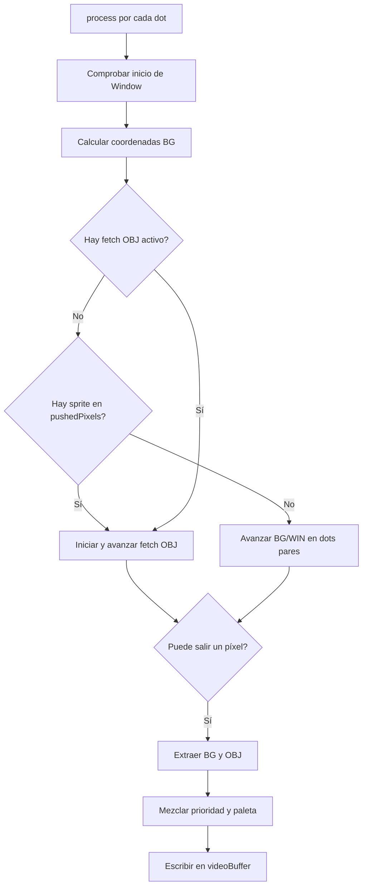

# FIFO Fetcher de la PPU

Este documento describe `FifoFetcher.kt`, responsable de producir los píxeles de Background/Window (BG/WIN), obtener los píxeles de objetos (OBJ o sprites), mezclarlos y escribir el resultado de cada scanline en el búfer de vídeo.

## Flujo general

`PPU.drawLCDMode()` llama a `process()` una vez por dot durante el modo 3. El flujo es:



El fetcher BG/WIN avanza cada dos dots. Un fetch OBJ se procesa dot a dot y bloquea temporalmente `pushPixelsToBuffer()`, alargando el modo 3. `pushedPixels` representa la coordenada X visible; `lineX` también incluye los píxeles de BG descartados por `SCX & 7`.

## Cómo trabajan juntos BG/WIN y OBJ

Aunque el código mantiene dos máquinas de estados y dos FIFO, no produce ambos tipos de píxel de manera completamente independiente. `fetch()` actúa como árbitro del pipeline: normalmente cede los dots pares al fetcher BG/WIN, pero entrega temporalmente el control al fetcher OBJ cuando la salida alcanza el inicio de un sprite.

### 1. Preparación del fondo

BG/WIN obtiene un índice de tile del tilemap, lee sus bytes bajo y alto y decodifica ocho índices de color. Los píxeles se guardan en `backgroundFifo`. Cada entrada conserva:

- `value`: color ARGB obtenido mediante BGP.
- `colorIndex`: valor crudo 0–3 anterior a la paleta.

El índice crudo es esencial: la prioridad OBJ no depende del color ARGB resultante, sino de si el índice BG/WIN es cero.

### 2. Detección y detención por OBJ

Antes de avanzar BG/WIN, `fetch()` llama a `findSpriteToFetch()`. Cuando `pushedPixels` coincide con el borde izquierdo visible de un objeto, ese objeto pasa a `activeSprite`. Desde ese momento `tickObjFetcher()` devuelve `false` y `process()` deja de llamar a `pushPixelsToBuffer()`.

La coordenada visible queda congelada mientras el fetch OBJ consume sus dots. El BG FIFO tampoco pierde píxeles: únicamente puede avanzar dentro de `SYNC_BG_FETCHER` si estaba vacío. Esta detención representa la penalización que alarga el modo 3 en el hardware.

### 3. Obtención e inserción del sprite

El fetcher OBJ sincroniza BG/WIN, aplica la penalización especial de `SCX` en el borde izquierdo, consume los estados de avance y lee los dos bytes de la fila OBJ. Después `pushSpritePixels()`:

1. Garantiza ocho posiciones en `spriteFifo`, rellenándolas con transparencia.
2. Calcula la posición de cada píxel respecto a `pushedPixels`.
3. Decodifica el índice 0–3 y aplica `X_FLIP` cuando corresponde.
4. Ignora el índice 0, porque es transparente para OBJ.
5. Mezcla el píxel con cualquier sprite que ya ocupe esa posición.

Los sprites que comienzan en la misma X se procesan consecutivamente porque `pushedPixels` permanece congelado. `mergeSpriteAt()` resuelve el solapamiento antes de que la salida continúe: en DMG gana la menor X y después el menor índice OAM; en CGB se usa el orden OAM.

### 4. Reanudación y mezcla final

Al llegar a `FINISH`, el objeto se marca como procesado y la salida puede continuar. Por cada píxel visible, `pushPixelsToBuffer()` extrae una entrada BG/WIN y, si existe, la posición equivalente del FIFO OBJ. `mixPixels()` decide el resultado:

- OBJ con índice 0: se muestra BG/WIN.
- OBJ detrás de un BG/WIN con índice 1–3: se muestra BG/WIN.
- En los demás casos: se muestra OBJ después de aplicar OBP0 u OBP1.

Así, los sprites no se mezclan al leer VRAM. Primero se combinan entre ellos dentro del FIFO OBJ y solo al producir el píxel final se comparan con BG/WIN.

### 5. Scroll fino y cambio a Window

Al principio de una línea, `SCX & 7` hace que se descarten varios píxeles del FIFO BG. Esos descartes no consumen `spriteFifo`, porque sus posiciones ya están expresadas en coordenadas visibles.

Cuando la salida alcanza `WX - 7`, `initWindow()` reinicia la máquina BG/WIN y vacía `backgroundFifo` para comenzar a obtener tiles de Window. El FIFO OBJ se conserva: Window sustituye al fondo como fuente de BG/WIN, pero los sprites continúan asociados a la misma coordenada de pantalla.

### Ejemplo de una línea con un sprite

```text
BG:    obtiene tile -> llena BG FIFO -> salen píxeles 0..39
OBJ:                                  detecta sprite en X=40
Salida:                               se detiene
OBJ:    sincroniza -> penaliza -> lee low/high -> mezcla 8 posiciones
Salida:                                                    se reanuda en X=40
Mix:                                                       BG[40] + OBJ[40]
```

La pausa cambia la duración de modo 3, no la coordenada final del sprite: durante ella no aumenta `pushedPixels`.

## Estados y datos

### `FetcherState`

- `OBTAIN_TILE`: obtiene el índice del tile BG/WIN.
- `LOW_DATA_TILE` y `HIGH_DATA_TILE`: leen los dos planos de bits de la fila.
- `SLEEP`: espera antes de intentar insertar el tile.
- `PUSH`: introduce ocho píxeles en `backgroundFifo` si hay espacio.

### `ObjFetcherState`

`GET_TILE` busca un sprite; `SYNC_BG_FETCHER` prepara el FIFO de fondo; `SCX_PENALTY` aplica la penalización de sprites en X=0; `ADVANCE_FIRST` y `ADVANCE_SECOND` consumen los dots previos a VRAM; `LOW_DATA_TILE` y `HIGH_DATA_TILE` leen la fila; `PUSH` mezcla sus ocho posiciones en el FIFO OBJ; `FINISH` libera el sprite y permite reanudar la salida.

### Estructuras auxiliares

- `FetchedTileData`: mantiene `tileIndex`, `lowData` y `highData` del tile actual.
- `FifoEntry`: píxel BG/WIN con color ARGB (`value`) e índice de color crudo (`colorIndex`). El índice crudo es necesario para decidir prioridades antes de aplicar el color final.
- `FifoEntrySprite`: añade paleta, prioridad BG/OBJ, índice OAM y X del sprite.
- `Fifo`: lista enlazada usada tanto por BG/WIN como por OBJ.

## Funciones de `Fifo`

- `push(value, colorIndex)`: añade un píxel BG/WIN al final.
- `ensureSpriteSize(targetSize)`: completa el FIFO OBJ con píxeles transparentes hasta alcanzar el tamaño indicado.
- `mergeSpriteAt(index, sprite)`: inserta un píxel OBJ en una posición existente. Ignora el color 0 y resuelve solapamientos por índice OAM en CGB, o por X e índice OAM en DMG.
- `makePush(newEntry)`: operación interna que enlaza una entrada y actualiza cabeza, cola y tamaño.
- `pop()`: extrae la primera entrada.
- `popSprite()`: extrae y convierte la primera entrada a `FifoEntrySprite`.
- `peek()`: consulta el valor de la primera entrada sin extraerla.
- `isEmpty()` y `getSize()`: consultan el estado del FIFO.
- `clear()`: elimina todas las entradas.

## Control principal de `FifoFetcher`

- `process()`: punto de entrada de cada dot. Comprueba Window, calcula `mapX`, `mapY` y `tileY`, avanza el fetch apropiado y, si no existe bloqueo OBJ, intenta producir un píxel.
- `fetch()`: selecciona entre BG/WIN y OBJ. Devuelve `true` cuando se puede consumir el siguiente píxel de los FIFO.
- `tickBGWINFetcher()`: ejecuta la función asociada al estado BG/WIN actual.
- `tickObjFetcher()`: ejecuta un estado OBJ. Devuelve `false` mientras el fetch OBJ mantiene detenida la salida.

## Obtención de BG y Window

- `getTile()`: obtiene el tile actual, cambia a lectura del byte bajo e incrementa `fetchX` ocho píxeles.
- `getBGTile()`: selecciona el tilemap BG o Window, calcula sus coordenadas y resuelve el modo de direccionamiento firmado.
- `getTileLowData()` y `getTileHighData()`: leen los dos bytes de la fila del tile.
- `sleepState()`: cambia al estado `PUSH`.
- `pushState()`: intenta insertar el tile; reinicia el ciclo solamente si el FIFO tenía espacio.
- `pushBGPixelsToFifo()`: decodifica los dos bitplanes en ocho índices de color, aplica BGP y los añade a `backgroundFifo`.
- `calculateTileDataOffset()`: devuelve la fila de dos bytes que corresponde a `LY`; usa coordenadas relativas a `WY` para Window.

## Obtención de sprites

- `findSpriteToFetch()`: busca el primer objeto de la línea que aún no se ha procesado y cuyo X visible coincide con `pushedPixels`. Los sprites parcialmente fuera de la izquierda se activan en X=0.
- `startSpriteFetch(sprite)`: guarda el objeto activo, limpia sus bytes temporales y entra en sincronización.
- `syncBgFetcher()`: avanza BG/WIN si su FIFO está vacío y continúa cuando ya existe fondo para mezclar.
- `applyScxPenalty()`: consume `SCX & 7` dots para un sprite situado en el borde izquierdo.
- `consumeDots(dots, nextState)`: contador reutilizable para estados con duración fija.
- `getObjTileLowData()` y `getObjTileHighData()`: leen ambos bitplanes de la fila OBJ desde VRAM.
- `getObjTileDataAddress()`: calcula tile, fila y dirección. Gestiona sprites 8×8, 8×16 y `Y_FLIP`.
- `pushSpritePixels()`: decodifica ocho píxeles, aplica `X_FLIP` y los mezcla por posición en `spriteFifo`. El índice 0 permanece transparente.
- `finishObjFetch()`: marca el índice OAM como procesado y vuelve a `GET_TILE`.

## Mezcla y salida

- `mixPixels(backgroundPixel, spritePixel)`: devuelve BG si no hay OBJ visible o si el flag de prioridad coloca BG 1–3 delante. En caso contrario aplica `OBP0/OBP1` al índice OBJ.
- `pushPixelsToBuffer()`: requiere al menos ocho píxeles BG. Descarta primero `SCX & 7`, sin consumir el FIFO OBJ, y escribe el píxel mezclado en `videoBuffer`.
- `putValueToVideoBuffer(address, value)`: escribe un color ARGB.
- `getValueFromVideoBuffer(address)`: permite a la PPU consultar el color almacenado.
- `getPushedPixels()`: devuelve cuántos píxeles visibles lleva la línea.

## Window y reinicio

- `initWindow()`: inicia Window cuando `LY >= WY` y la salida alcanza `WX - 7`. Reinicia el fetch BG/WIN y vacía únicamente su FIFO.
- `isWindowTile()`: indica si el fetch actual pertenece a Window.
- `resetParams()`: prepara una scanline nueva: reinicia coordenadas, estados, tiles temporales, objetos procesados y ambos FIFO.
- `clear()`: vacía los FIFO BG/WIN y OBJ, normalmente al terminar el modo 3.

## Limitaciones actuales

El flujo implementa el fetch OBJ funcional de DMG, pero todavía no reproduce todos los puntos de cancelación descritos por Pan Docs. CGB conserva la prioridad OAM básica, aunque faltan las paletas OBJ de CGB, los atributos BG CGB y el acceso explícito al banco de VRAM indicado por el sprite.
